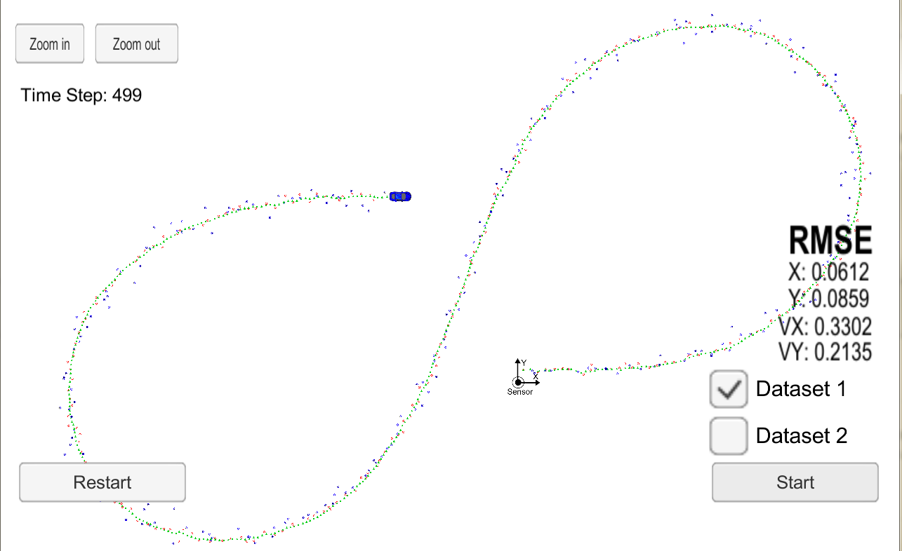
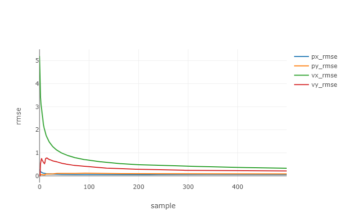

# Unscented Kalman Filter Project Starter Code

**This project uses same data/simulator as Extended Kalman filter project [EKF](https://github.com/atul799/CarND-Extended-Kalman-Filter-Project).**

# Project Goals
---
The goal of this project are the following:

* Build an Unscented Kalman Filter by applying the Unscented Kalman filter processing steps.
* Test the Kalman Filter for given measurement (Radar and Laser) and ground truth data
* Calculate Normalized Innovation Squared metric to evaluate effectiveness of parameters
* Summarize the results with a written report.

 *Unscented Kalman Filter in Action*

# Overview of the Project
---

In this project a kalman filter is used to estimate the state of a moving object of interest(bicycle) with noisy lidar and radar measurements. 

The Kalman Filter algorithm will go through the following steps:

* First measurement - the filter will receive initial measurements of the bicycle's position relative to the car. These measurements will come from a radar or lidar sensor.
* Initialize state and covariance matrices - the filter will initialize the bicycle's position based on the first measurement.
* Then the car will receive another sensor measurement after a time period Δt.
* Predict - the algorithm will predict where the bicycle will be after time Δt. In this project, constant turn rate and velocity magnitude model (CTRV) is used to model motion of the car. There are other motion models possible such as constant turn rate and acceleration (CTRA),constant steering angle and velocity (CSAV),constant curvature and acceleration (CCA). CTRV model is non-linear hence predicted error ellipse is going to be non-gaussian. To work with kalman filter in presence of non-gaussian motion model, an unscented transform method is used and will be described in detail in following section, to make state prediction.

* Update - the filter compares the "predicted" location with sensor measurement data. The predicted location and the measured location are combined to update state vector. The Kalman filter will put more weight on either the predicted location or the measured location depending on the uncertainty in process covriance matrix.
* Then the car will receive another sensor measurement after a time period Δt. The algorithm then repeats predict and update step for each measurement.

# CTRV motion model
---

A process(motion) model with constant velocity used in Extended Kalman filter project predicts position of turning vehicles incorrectly.Constant turn rate and velocity magnitude model (CTRV) models motion considers constant velocity as well as turn hence makes more accurate predictions.

 *CTRV model*

The State vector for CTRV model is:

 *CTRV state vector*

position in x and y dimension,velocity,yaw and yaw rate are components of state vector.

The motion can be modeled as:

 *CTRV state vector*

Here, process model,f(xk,vk) is composed of , current state (x(k)) ,motion based on velocity/yaw/yawrate and delta_t and process noise based on nuacceleration and nuyaw_acceleration. nuacceleration and nuyaw_acceleration are considered gaussian with zero mean.

# Unscented transform process and Kalman filter steps
---

Here is a pictorial representation of steps in UKF implementation.

 *Unscented Kalman filter Roadmap*

Let's follow through the steps described in image above.

# Prediction step:
---

The non-linearity of process model, necessitates use of unscented transform as resultant  error ellipse (P) is non-gaussian. Unscented transform process samples sigma points in current state vector, applies a spread parameter (lambda, normally chosen as 3-nr_of_state_vector_elements) and then using process model, corresponding sigma points are predicted. The state vector (x) and process covariance matrix (P) is then calculated from predicted sigma points.
The predicted state and covariance matrix are not analytically calculated but are approximate values.
 
The image below explains this process:
 *need for unscented transform*

Our goal is to generate a gaussian error ellipse from a non-gaussian error ellipse.

 *Unscented transform*

### Sigma point generation and augmentation for process noise effect:
The fist step is to sample sigma points from current state vector.
This is achieved by sampling 2*nr_of_state_vector_elements + 1 points in state vector space.
However, to consider impact of process noise the sigma points are augmented with process noise variables.

Here is the method to generates augmented sigma points.

 *Augmented Sigma point generation*

### Predict Sigma points:
Augmented Sigma points matrix is transformed to predicted sigma points matrix using process model.
Notice the predicted sigma point matrix has same x dimension as state vector.
 *Predicted Sigma points*

### Predict mean and covariance
Below is how state vector and covariance matrix is calculated for prediction step.
 *Predict Mean and covariance*

The state vector and covariance matrix are multiplied with weights for each sigma point column. The weights depend on spreading parameter lambda. 

# Update Step
---

Now that we have predicted state and covariance matrix we can use the similar steps as used in linear/extended kalman filter implementation to update state and covariance matrix.
In this step, kalman gain is calculated and predicted state and measured state are used to calculate updated state vector and process covariance matrix.

### Laser measurements update
Laser measures position directly, hence linear kalman update process is used to update  state with Laser measurements. Update step for laser using unscented kalman transform is tried as well and results are quite close.

### Radar measurements update
Radar measures rho (polar position),phi(bearing) and rhodot(radial velocity) hence linear kalman update steps can't be applied (polar to cartesian coordinate transformation). Unscented transform method is used to update radar measurements.2 short cuts are taken, 

	1. Predicted sigma points are re-used to skip generating sigma points again.
	2. Augmentation step is skipped because measurement noise has purely additive effect
 
So, this step is to transform predicted sigma points in update step using measurement model.
 *Radar predicted measurement transformation*

The mean and coviarnce of predicted state vector can be derived in exactly same way as in update step
 *Radar predicted mean and covariance* 

Then updated state and covariance matrix are calculated:

 *UKF Update*

# Consistency check
---

Consistency of kalman (or in general any bayesian filter) is evaluated by calculating Normalized innovation squared, which is calcuated as:

 *Calculating NIS*

The NIS value should (most times) be under chi-square limit distribution, which depends on state variables measured by sensor.
 *chi-squared table*

for example radar measures 3 state variable, hence for 95% accuracy, NIS shall be below 7.8 most of the time. For laser which measures 2 state variable the number is 5.99.

If the NIS is consistently above NIS chisquared limit, that indicates process noise parameters chosen are too optimistic and if they are far below NIS then process noise parameters (hence predictions) are pessimitic. 

# Implementation
---

The C-code implementing UKF are in directory src in this repo.

The unscented kalman filter related functions are in file: ukf.h and ukf.cpp

Class UKF is defined with data members, x_,P_,Xsig_pred_,weights_,R_radar_,R_laser_,process and measurement noise. UKF class also has method members Predict (prediction steps common to Laser and Radar),UpdateLidar (update step for laser measurement) and UpdateRadar (update step for Radar measurement).An additional method UpdateLidar_unscented is implemented to test linear vs unscented transfrom for laser upadate.

Data members of UKF class are initialized in constructor.ProcessMeasurement method initializes the UKF object state vector(x_) and process covariance matrix (P_) with first measurement, and calls Predict/UpdateLidar or UpdateRadar methods to predict or update  KalmanFilter object based on type or measurement data (based on bool value of use_lidar_ or use_radar_).

NIS for laser and radar is implemented in corresponding update method.

File measurement_package.h define class MeasurementPackage that has data member SensorType and raw_measurements_.

File tools.cpp defines Tools class that has CalculateRMSE as members.

main.cpp file interacts with [simulator](https://github.com/udacity/self-driving-car-sim/releases), calls ProcessMeasurement to estimate x and P values, calculates rmse and passes them to simulator.

The estimated/measured state vector values,ground truth values and nis values are captured and stored in file in ../outputs directory. The data captured is then postprocessed using python notebook ukf-visualization-extended.ipynb [python post processing script](https://github.com/atul799/CarND-Unscented-Kalman-Filter-Project/python/ukf-visualization-extended.ipynb)

# Results
---
The implemented UKF was run in simulator with both sensor measurements as well as individual sensors measurement data.
The process noise parameters std_a_ and std_yawdd_ are tuned to get NIS under specified limit.

 Here are results:

* Estimations after tuning process noise parameters:

 

* px comparison between ground truth vs estimated vs measured
 

* velocity comparison between ground truth vs estimated

 

* yaw angle comparison between ground truth vs estimated
 

* yaw rate comparison between ground truth vs estimated

 

* NIS_laser

 

* NIS_radar 

 

* RMSE

 

As can be seen, NIS values are within chi-sqaure bounds most of the time for laser and radar. 

* Combining laser and radar data RMSE on px/py/vx/vy achieved is:

| px\_rmse | py\_rmse | vx\_rmse | vy\_rmse|
| :---: | :---: | :---: | :---: |
| 0.061 | 0.085 | 	0.330 | 0.214 |

These values are better than achieved in Extended Kalman filter project. 

The value of process noise parameters chosen are:
Process noise standard deviation longitudinal acceleration in m/s^2 is: 0.5
Process noise standard deviation yaw acceleration in rad/s^2 is:0.5

 
The output (state vectors and rmse) of experiments with both sensors and either radar or laser is in directory outputs along with images captured using python code in [utilities repo](https://github.com/udacity/CarND-Mercedes-SF-Utilities)

# Source Code, Compilation and Run
--- 
To compile and run the EKF code, following steps are required:
(Assuming uWebSocketIO is complete)

1. cd build
2. cmake ..
3. make
4. ./UnscentedKF
5. open unity Simulator, choose data and run

## Dependencies

Tips for setting up your environment can be found [here](https://classroom.udacity.com/nanodegrees/nd013/parts/40f38239-66b6-46ec-ae68-03afd8a601c8/modules/0949fca6-b379-42af-a919-ee50aa304e6a/lessons/f758c44c-5e40-4e01-93b5-1a82aa4e044f/concepts/23d376c7-0195-4276-bdf0-e02f1f3c665d)

Here is the main protcol that main.cpp uses for uWebSocketIO in communicating with the simulator.

INPUT: values provided by the simulator to the c++ program

["sensor_measurement"] => the measurment that the simulator observed (either lidar or radar)

OUTPUT: values provided by the c++ program to the simulator

["estimate_x"] <= kalman filter estimated position x
["estimate_y"] <= kalman filter estimated position y
["rmse_x"]
["rmse_y"]
["rmse_vx"]
["rmse_vy"]

---

## Other Important Dependencies
* cmake >= 3.5
  * All OSes: [click here for installation instructions](https://cmake.org/install/)
* make >= 4.1 (Linux, Mac), 3.81 (Windows)
  * Linux: make is installed by default on most Linux distros
  * Mac: [install Xcode command line tools to get make](https://developer.apple.com/xcode/features/)
  * Windows: [Click here for installation instructions](http://gnuwin32.sourceforge.net/packages/make.htm)
* gcc/g++ >= 5.4
  * Linux: gcc / g++ is installed by default on most Linux distros
  * Mac: same deal as make - [install Xcode command line tools](https://developer.apple.com/xcode/features/)
  * Windows: recommend using [MinGW](http://www.mingw.org/)

